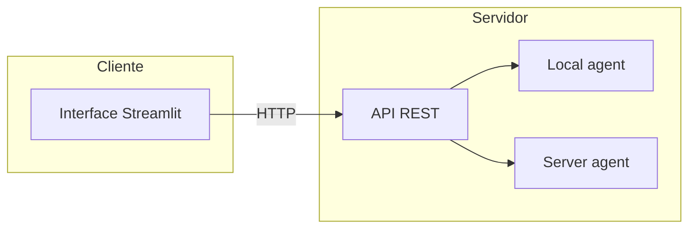
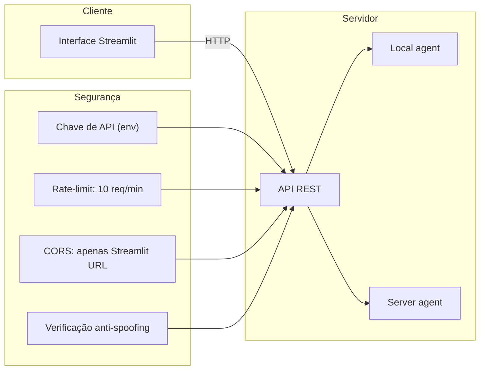
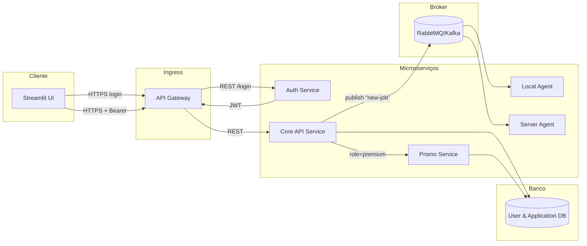

# TRABALHO PRÁTICO DA DISCIPLINA DE SISTEMAS DISTRIBUÍDOS (2025/1)

# Automação de Atendimento em E-commerce

## Problema

No e-commerce de varejo, o canal de chat web apresenta longos tempos de espera e alta taxa de abandono, gerando insatisfação do cliente e perda de conversões.

## Validação do Problema

Estudos de mercado mostram que longos tempos de espera em chat de e-commerce prejudicam diretamente a satisfação do cliente e a conversão de vendas. Segundo a HubSpot, **66 % dos consumidores** esperam uma resposta em até 5 min via live chat¹, e aproximadamente **66 % consideram** essencial receber uma resposta em até 10 min². Além disso, **42 % dos clientes** preferem atendimento em tempo real (chat) em vez de e-mail ou telefone³, e mais de **50 % abandonam** o chat se a espera for prolongada⁴.

Esses números revelam a “dor” central deste projeto: **demora no atendimento leva ao aumento da taxa de abandono e à perda de conversões**. É imprescindível automatizar e acelerar a primeira resposta para manter o engajamento e a satisfação do usuário.

### Dados-chave
- **66 %** dos consumidores esperam resposta em até 5 min via live chat¹  
- **≈ 66 %** consideram essencial resposta em até 10 min²  
- **42 %** preferem chat em tempo real a e-mail ou telefone³  
- **> 50 %** abandonam o chat por esperas prolongadas⁴  

## Justificativa

- Tempo médio de primeira resposta em sistemas atuais: **1 min 35 s**
- Padrão de excelência do mercado: responder em **menos de 1 min**

## Objetivos

1. Reduzir o tempo médio de primeira resposta de **1 min 35 s** para **< 30 s**
2. Diminuir a taxa de abandono de chat de **> 50 %** para **< 20 %**


# Estrutura do projeto

```plaintext
Sistemas-Distribuidos-2025-1/
├── agents/
│   ├── local_agent/
│   │   ├── app.py
│   │   ├── Dockerfile
│   │   └── requirements.txt
│   └── server-agent/
│       ├── faq.json
│       └── server.py
├── API/
│   └── wrapper.py
├── interface/
│   ├── app.py
│   ├── index.html
│   └── style.css
├── .env
├── .env.example
├── .gitignore
└── README.md
``` 


## Metodologia

- **Agentes de IA**
  - Agente externo via API.
  - Agente local containerizado em Docker.
- **Comunicação distribuída**
  - Broker ou A2A.
  - Cada agente como microserviço orquestrado.
- **API de Agregação**
  - FastAPI que recebe as mensagens do chat, chama os agentes e retorna a resposta ao cliente.
- **Segurança e Arquitetura**
  - Modelagem STRIDE e mitigação (TLS, JWT, rede isolada).
  - Diagramas C4 pré e pós-mitigação.

## Metas de Sucesso

- **Primeira resposta** do agente em < 30 s no ambiente de testes.
- **Taxa de abandono** < 20 % aferida pelos logs de chat.

## 4. Documentação Arquitetônica

### 4.1 Visão Inicial (pré-modelagem de ameaças) – 7 pts

**Descrição**  
Aqui descrevemos os principais componentes do sistema antes de pensarmos nas ameaças.  

**Diagrama de Componentes**  

Esse diagrama deixa alguns cuidados que foram tomados de lado, por se tratarem de detalhes mais específicos, mas que podem ser observados no projeto, tal como:
  - Chave de API em variáveis de ambiente (env)  
  - Rate-limit: 10 requests / minuto  
  - CORS restrito só à URL da Streamlit  
  - Verificação de API para evitar spoofing

# Diagrama intermediário ressaltando alguns detalhes de implementação




## Descrição Detalhada por Componente

### 1. Cliente: Streamlit UI

- Tecnologia: Streamlit (Python)

- Função: Expor uma interface web interativa, com gráficos, formulários e controles de entrada de dados.

Mitigações STRIDE:

- HTTPS/TLS em todas as requisições impede interceptação (MITM) e garante confidencialidade e integridade. (S, I)

- Content Security Policy (CSP) e escape automático de conteúdo evitam injeção de scripts maliciosos (XSS). (T, I)

- Validação de inputs no cliente reduz carga no servidor e mitiga ataques triviais de injeção. (T)

### 2. Ingress: API Gateway / Load Balancer

- Tecnologia: NGINX / Kong / AWS ALB

- Função: Ponto único de entrada HTTP(S), responsável por roteamento, autenticação inicial, CORS, rate-limiting e SSL termination.

Mitigações STRIDE:

- Rate limiting configurado em 10 req/min por cliente, bloqueando rajadas de chamadas. (D)

- CORS restrito à URL da interface, evitando acessos indevidos. (I)

- Verificação de JWT e claims em cada chamada, rejeitando tokens inválidos ou expirados. (S, E)

- API Key check para comunicação interna, impedindo spoofing de serviço. (S)

- TLS Termination + re-encrypt mantém encriptação fim-a-fim. (I)

- Plugins de segurança (ACLs, bloqueio de IP, logs centralizados). (R)

### 3. Auth Service

- Tecnologia: FastAPI / Flask + PyJWT + Argon2

- Função: Autenticação de usuários, emissão de JWT assinados e gestão de refresh tokens.

Mitigações STRIDE:

- Hash de senhas com Argon2 e salt único, protegendo credenciais. (S)

- JWT RS256, com chaves RSA mantidas em variáveis de ambiente, garantindo assinatura forte. (S, E)

- Expiração curta (exp) e uso seguro de refresh tokens, limitando janela de uso de um token roubado. (S)

- Lockout/CAPTCHA após tentativas falhas de login, prevenindo ataques de força bruta. (D, S)

### 4. Core API Service

- Tecnologia: Python (wrapper.py) + SQLAlchemy/ORM + Pydantic

- Função: Orquestrar regras de negócio, publicar eventos de “new-job” e acessar o banco de dados.

Mitigações STRIDE:

- Validação de JWT em cada endpoint, extraindo sub e role para autorização. (S, E)

- Queries parametrizadas via ORM para evitar SQL injection. (T)

- .env para credenciais de DB e broker, reduzindo risco de vazamento. (I)

- Correlation IDs e logs append-only para auditoria. (R)

### 5. Promo Service

- Tecnologia: Python micro-service (promo.py)

- Função: Gerar e entregar promoções apenas para usuários com role = premium.

Mitigações STRIDE:

- RBAC reforçado no gateway e no serviço, garantindo que somente tokens com role=premium acessem. (E, I)

- Logs de acesso dedicados aos endpoints de promoção. (R)

### 6. Message Broker

- Tecnologia: RabbitMQ ou Kafka em cluster

- Função: Barramento assíncrono que desacopla publishers (Core API) de consumidores (Agents).

Mitigações STRIDE:

- TLS mútua + SASL para autenticação de produtores/consumidores. (S, T)

- ACLs de tópico para cada serviço, limitando quem publica e consome. (E, I)

- QoS / prefetch limits para prevenir flooding interno e DoS. (D)

### 7. Agents (Local & Server)

- Tecnologia: Python containerizado (agent.py)

- Função: Consumir tarefas de “new-job” e executar processamento.

Mitigações STRIDE:

- Autenticação mTLS ou tokens de serviço no broker. (S)

- Validação de payload antes do processamento. (T)

- Isolamento em containers com privilégios mínimos. (E)

### 8. Banco de Dados (User & Application DB)

- Tecnologia: PostgreSQL / MongoDB em cluster replicado

- Função: Armazenar credenciais, perfis, logs e dados de aplicação.

Mitigações STRIDE:

- TLS em conexões de cliente/serviço. (I)

- Encryption at rest para dados sensíveis. (I)

- Contas com privilégios mínimos para cada serviço. (E)

- Auditoria de queries e logs append-only. (R, T)

Legendas STRIDES = Spoofing, T = Tampering, R = Repudiation, I = Information Disclosure, D = Denial of Service, E = Elevation of Privilege


# Diagrama arquitetura final(ideal)




### Referências
1. HubSpot. _How Consumers Use Live Chat for Customer Service_ (2021).  
2. Gorgias. _22 Live Chat Statistics You Need To Know_ (2023).  
3. Zendesk CX Trends Report 2024.  
4. Alexander Jarvis. _What Is Live Chat Abandonment Rate in E-commerce?_ (2025).  